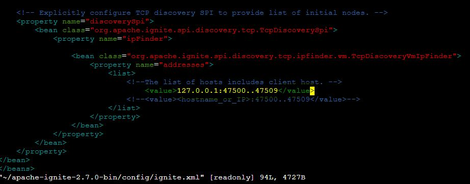

# Apache Ignite

Before proceeding ahead, reserve a server with the specifications mentioned in the main README to reproduce our exact results.

1. As the CloudLab server we get is pretty bare bones, go ahead and run the server_setup.sh script that installs the necessary system dependencies.

```
sudo bash ./server_start.sh
```

2. Then go ahead run the script to install Apache Ignite v2.7.0

```
sudo bash ./install_ignite.sh
```

The latest version of Ignite is 2.16.0 but it isn't compatible with YCSB so we install the 2.7.0 version.
Note that there are many different ways to install Ignite, but this is the quickest and most hassle free way to install it for running the experiments.

3. We then need to install YCSB

```
sudo bash ./install_ycsb.sh
```

Note that the installation script installs both the YCSB binary as well as the source code which contains necessary binaries and configs that are copied to the Ignite installation directory which are necessary to run the workloads for Ignite.

4. Now we need to copy the necessary YCSB specific binaries and configs required to benchmark Apache Ignite, we do so through the below command

```
sudo bash ./copy_ignite_configs.sh
```

5. As we are running our multi-node cluster locally, Ignite needs the host IP (localhost or 127.0.0.1 in our case) along with the range of ports that newly setup Ignite nodes would occupy, for this we need to change a single line in the config file present in `~/apache-ignite-2.7.0-bin/config/ignite.xml`. Using your favourite text editor, just go ahead and edit/add the following line towards the end of your config as shown.



6. Once this is done, we are good to go and can now launch our multi-node cluster using the following script

```
sudo bash ./launch_ignite_instances.sh <number_of_instances>
```

The above script launches a variable number of instances supplied by the user (We have tested the script for the setup of a max of nine-node cluster). Each node is started in its own tmux session having session name ignite0, ignite1 etc.

7. Once the cluster is up, we need can run the YCSB workload using the following commands (we consider Workload A as an example)

Loading the Workload Data:

```
sudo ~/ycsb-0.17.0/bin/ycsb.sh load ignite -p hosts="127.0.0.1" -s -P ~/ycsb-0.17.0/workloads/workloada -threads 4 -p operationcount=100000 -p recordcount=100000
```

Running the Workload:

```
sudo ~/ycsb-0.17.0/bin/ycsb.sh run ignite -p hosts="127.0.0.1" -s -P ~/ycsb-0.17.0/workloads/workloada -threads 4 -p operationcount=100000 -p recordcount=100000 
```

Note that the threads, operationcount and recordcount are the default values and we have chosen to stick with them for all the Key-Value Stores under consideration.

8. Once the experiment conlcudes, the cluster nodes can be brought down by executing the following script:

```
sudo bash ./stop_ignite_instances.sh
```
